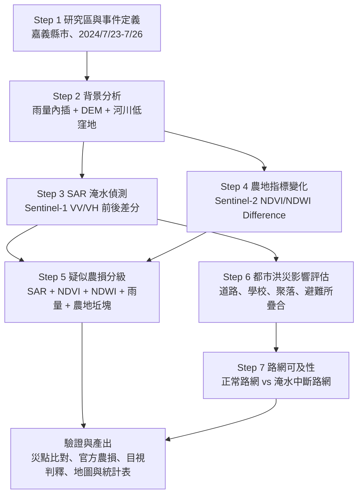

# 案例 C：2024 凱米颱風都市洪災與農損之遙測與空間資訊分析報告

## 一、研究背景

2024 年凱米颱風是 2024 年西北太平洋第 3 號颱風，中央氣象署資料顯示其生成時間為 2024 年 7 月 20 日 14 時，結束時間為 2024 年 7 月 27 日 02 時，強度達「強烈」等級。凱米於 2024 年 7 月 23 日至 26 日影響臺灣，颱風在花蓮外海附近出現約 11 小時的打轉現象，使強風與豪雨影響時間延長，並在中南部造成顯著淹水與農業災損。

本研究選擇案例 C「凱米颱風：都市洪災 + 農損」作為分析主題，並以嘉義地區作為主要研究區。嘉義位於臺灣西南部，包含沿海低窪地、八掌溪與朴子溪等流域、農業生產區與都市聚落。凱米颱風期間，中南部因颱風環流、西南風水氣與地形效應產生長延時降雨，且適逢天文大潮，增加沿海與低窪地區積淹水風險。農業部統計至 2024 年 8 月 8 日 17 時，凱米颱風造成全臺農業產物及民間設施損失約新臺幣 36 億 301 萬元，其中嘉義縣損失約 4 億 6,619 萬元，占 13%，為主要受災縣市之一。

期中報告已先以嘉義農田為試驗區，進行颱風前後 Sentinel-2 多光譜影像之 NDVI 與 NDWI 差分分析。初步結果顯示，NDVI Difference 統計值為 min = -0.6140、max = 0.5969、mean = 0.0053、std = 0.1480；NDWI Difference 統計值為 min = -0.5438、max = 0.5188、mean = 0.0269、std = 0.1108。整體平均值未呈現單一明確的植被下降趨勢，但局部農地出現 NDVI 下降與 NDWI 上升，可能反映颱風後作物倒伏、植被受損、土壤濕潤或局部積水。本報告將在此基礎上，將研究範圍擴大至嘉義地區，並整合 SAR 淹水偵測、雨量 API、空間內插、路網與緩衝區分析，建立完整的災害分析流程。

## 二、研究目的

本研究目標是建立一套結合遙測影像與向量空間分析的颱風災害評估流程，用於判讀凱米颱風對嘉義地區都市洪災與農業損失的影響。具體目的如下：

1. 以 Sentinel-1 SAR 偵測颱風後嘉義地區可能積淹水範圍，補足光學影像受雲覆蓋影響的限制。
2. 以 Sentinel-2 NDVI、NDWI 差分分析農地植被健康與水分變化，辨識可能受損農地。
3. 以氣象測站雨量資料與 Kriging 或 IDW 空間內插建立降雨分布圖，分析高雨量區與淹水、農損訊號的空間關係。
4. 以 GeoPandas、Buffer、Overlay 與 OSMnx 路網分析評估受影響聚落、學校、道路與避難所可及性。
5. 建立多源資料交叉驗證策略，提高災害判釋可信度。

## 三、問題拆解

### Q1：凱米颱風後嘉義哪些地區發生積淹水？

此問題以 Sentinel-1 SAR 為主要資料。SAR 具備穿雲與日夜皆可成像的特性，適合在颱風後雲量高、光學影像不穩定時進行淹水偵測。分析重點是比較颱風前後 VV、VH 後向散射係數變化，並建立水體或淹水區遮罩。

### Q2：哪些農地可能受到作物倒伏、植被受損或積水影響？

此問題延續期中報告的 NDVI 與 NDWI 差分分析。NDVI 下降可代表植被活性降低、作物倒伏、葉面受損或裸露地增加；NDWI 上升可代表地表水分增加、土壤濕潤或局部積水。若同一農地同時出現 NDVI_after - NDVI_before < 0 與 NDWI_after - NDWI_before > 0，且颱風前 NDVI 顯示該處原本為植被覆蓋農地，則可列為較高可信度的疑似受損農地。

### Q3：高雨量區是否與積淹水及農損訊號重疊？

此問題以中央氣象署測站雨量或雨量 API 作為資料來源，透過 Kriging 或 IDW 內插建立嘉義地區累積雨量面。再將雨量分布與 SAR 淹水範圍、NDVI/NDWI 變化圖層疊合，檢驗災害訊號是否集中於高雨量或低窪區域。

### Q4：哪些道路、聚落、學校或避難所受到淹水影響？

此問題使用向量資料回答「誰受影響」與「如何行動」。將 SAR 淹水範圍轉為向量多邊形後，與村里界、學校、道路、避難所、農地坵塊等資料進行 Overlay 與 Buffer 分析，可估算受影響設施數量、受影響道路長度與避難所服務範圍。

### Q5：若主要道路淹水，是否仍有替代避難路線？

此問題使用 OSMnx 與 NetworkX 進行路網可及性分析。先將位於淹水範圍內或鄰近淹水範圍的道路視為可能中斷路段，再模擬居民從聚落或學校到避難所的最短路徑與替代路線，評估災後交通韌性。

## 四、技術選擇與理由

| 子問題 | 技術 | 主線 | 選擇理由 |
|---|---|---|---|
| Q1 淹水範圍 | Sentinel-1 SAR 前後差分、閾值分類 | 柵格 | 颱風後雲量高，SAR 可穿雲並偵測水面 |
| Q2 農損判釋 | Sentinel-2 NDVI、NDWI 差分 | 柵格 | NDVI 反映植被健康，NDWI 反映水分或積水 |
| Q3 雨量關聯 | 雨量 API、Kriging 或 IDW | 向量轉柵格 | 將測站點資料轉為連續雨量面，檢驗災害原因 |
| Q4 影響評估 | GeoPandas Overlay、Buffer | 向量 | 統計受影響學校、道路、聚落、農地與避難所 |
| Q5 路網可及性 | OSMnx、NetworkX | 向量 | 模擬道路中斷後的避難路線與替代可及性 |
| 結果驗證 | 災情通報、新聞、農業部資料、目視判釋 | 整合 | 避免單一影像指標誤判 |

本案例的核心不是只選擇單一工具，而是整合「柵格判讀災害位置」與「向量評估受影響對象」。SAR 與光學影像回答「哪裡發生變化」，雨量與地形資料解釋「為什麼在那裡發生」，路網與設施資料則回答「災害對人、農業與交通造成什麼影響」。

## 五、資料需求

### 遙測資料

1. Sentinel-1 GRD SAR：選擇颱風前與颱風後影像，建議時間為 2024 年 7 月中旬至 8 月上旬。使用 VV、VH 極化資料進行後向散射差分與淹水偵測。
2. Sentinel-2 Surface Reflectance：選擇颱風前後雲量較低影像，建議颱風前為 2024 年 7 月上旬至 7 月 22 日，颱風後為 2024 年 7 月 26 日至 8 月中旬。使用 SCL 或 s2cloudless 進行雲與雲影遮罩。
3. DEM：可使用 SRTM、ALOS 或內政部 DEM，以坡度、高程與低窪區輔助判斷淹水易感區。

### 氣象與災情資料

1. 中央氣象署測站雨量資料：颱風影響期間建議統計 2024 年 7 月 23 日至 7 月 26 日累積雨量，並可細分為 24 小時與 96 小時雨量。
2. 中央災害應變中心災情資料：積淹水、道路災情、撤離與停電等紀錄。
3. 農業部農業災情報告：作為農損金額與受災縣市之官方參考。

### 向量資料

1. 嘉義縣市行政界、村里界。
2. 農地坵塊或土地利用資料。
3. 學校、醫療院所、避難收容處、抽水站等點位資料。
4. OpenStreetMap 道路資料，用於路網分析。
5. 河川、排水系統、淹水潛勢或低窪地資料。

## 六、分析流程

### Step 1：研究區與事件定義

以嘉義縣市作為主要研究區，必要時依災情聚焦於八掌溪、朴子溪沿岸、沿海低窪區與主要農業區。事件時間定義為 2024 年 7 月 23 日至 7 月 26 日，影像比較時間則以颱風前後可取得且雲量較低之影像為準。

### Step 2：雨量與地形背景分析

蒐集中央氣象署雨量測站資料，計算颱風期間累積雨量。透過 Kriging 或 IDW 內插產生雨量分布圖，並與 DEM 之高程、坡度、河川及低窪地資料疊合，建立嘉義地區災害背景。此步驟用來判斷哪些區域同時具有高雨量、低窪地形與河川鄰近性。

### Step 3：SAR 淹水偵測

使用 Sentinel-1 颱風前後 VV、VH 影像進行前處理，包括軌道校正、熱噪音移除、輻射校正、地形校正與 speckle filter。接著比較颱風前後後向散射變化。水面通常呈現較低後向散射，因此可透過固定閾值、Otsu 自動閾值或前後差分方式萃取可能淹水區。為避免將永久水體誤判為災後淹水，需扣除河川、池塘、魚塭等常態水體。

### Step 4：NDVI / NDWI 農地變化分析

以 Sentinel-2 計算颱風前後 NDVI 與 NDWI：

NDVI = (NIR - Red) / (NIR + Red)

NDWI = (NIR - SWIR 或 Green - NIR) / (NIR + SWIR 或 Green + NIR)

本研究延續期中報告結果，先以 SCL 雲遮罩排除雲、雲影與無效像元，再計算 Difference。初步試驗區結果顯示，NDVI Difference 平均值為 0.0053，整體並未明顯下降；NDWI Difference 平均值為 0.0269，表示颱風後地表水分訊號略增。然而，農業區受作物種類、收割、休耕、灌溉與生長期影響很大，因此不能只用全區平均值判斷農損。後續應先依颱風前 NDVI 或土地利用資料區分「非休耕植被覆蓋農地」與「休耕或裸露地」，再在非休耕區中尋找 NDVI 下降、NDWI 上升且與高雨量或淹水訊號重疊的區域。

### Step 5：農損熱區判釋

將 SAR 淹水圖、NDVI Difference、NDWI Difference、雨量內插圖與農地坵塊資料疊合，建立疑似農損分級：

| 等級 | 判釋條件 | 解讀 |
|---|---|---|
| 高可信度受損 | NDVI 下降 + NDWI 上升 + SAR 淹水或高雨量重疊 | 可能有作物倒伏、植被受損或積水 |
| 中可信度受損 | NDVI 下降，但 SAR 淹水不明顯 | 可能為風害、倒伏、收割或影像差異 |
| 水分增加區 | NDWI 上升，但 NDVI 未下降 | 可能為土壤濕潤、灌溉或短期積水 |
| 低可信度 | 指標變化不明顯或位於休耕裸露地 | 不直接判定為災損 |

此分級可輸出為農地坵塊層級的疑似受災清單，包括面積、平均 NDVI 差分、平均 NDWI 差分、是否位於 SAR 淹水區、累積雨量值與行政區。

### Step 6：都市洪災與設施影響評估

將 SAR 淹水範圍轉為向量多邊形，與學校、道路、村里、避難收容處、醫療院所等資料疊合。可計算：

1. 淹水範圍內或淹水範圍 100 公尺 Buffer 內的學校與公共設施數量。
2. 受淹水影響道路長度與道路等級。
3. 受影響村里數量與面積。
4. 避難所與淹水熱區的距離。
5. 農地受影響面積與各鄉鎮分布。

此步驟能將影像偵測結果轉換為決策者可使用的資訊。

### Step 7：路網可及性與替代路線

以 OSMnx 下載嘉義地區道路網，將淹水區內道路或距離淹水區一定範圍內的道路標記為可能中斷。接著以 NetworkX 比較兩種情境：

1. 正常情境：所有道路可通行。
2. 災後情境：移除受淹水影響道路。

比較各聚落或學校至最近避難所的最短路徑距離與時間，計算路徑增加量、無法到達節點，以及替代路線分布。若某些地區災後到避難所距離大幅增加，代表其交通韌性較低，應優先規劃替代通道或臨時收容點。

## 七、驗證策略

本研究至少採用以下四種驗證方式：

1. 與中央災害應變中心、地方政府或 NCDR 彙整之積淹水災點比對，檢查 SAR 偵測淹水範圍是否與災情報告一致。
2. 與農業部凱米颱風農業災情報告比對，檢查疑似農損熱區是否與高農損縣市及鄉鎮相符。
3. 使用颱風後高解析度影像、新聞照片或 Google Earth 歷史影像進行目視判釋，確認水體、農地倒伏或裸露地變化。
4. 進行多感測器交叉驗證：若 SAR 顯示淹水、NDWI 上升、NDVI 下降且雨量偏高，則判釋可信度較高；若只有單一指標異常，則列為待查。

驗證時需特別注意誤判來源。SAR 可能將平滑地表、魚塭或永久水體判為淹水；NDVI 下降可能來自收割、翻耕或休耕；NDWI 上升可能來自正常灌溉而非災害。因此，本研究不以單一閾值直接定義災損，而是採用多條件疊合與分級判釋。

## 八、預期成果

本研究預期產出如下：

1. 嘉義地區凱米颱風累積雨量分布圖。
2. Sentinel-1 SAR 颱風後疑似淹水範圍圖。
3. Sentinel-2 NDVI Difference 與 NDWI Difference 圖。
4. 疑似農損熱區分級圖與鄉鎮統計表。
5. 受淹水影響之道路、學校、村里與避難所空間疊圖。
6. 災前與災後道路可及性比較圖。
7. 完整分析流程圖與技術選擇表。

## 九、初步結果與期中進度延伸

期中報告已完成嘉義農田試驗區的 NDVI 與 NDWI 差分分析。從統計結果看，NDVI Difference 平均值為 0.0053，代表全區平均並未呈現明顯下降；NDWI Difference 平均值為 0.0269，代表颱風後水分訊號略為上升。此結果說明嘉義農地受到颱風影響的型態並非全區一致，而是呈現局部差異。

目前最重要的修正方向有三點。第一，需將期中報告文字中 NDVI 平均值誤寫為 0.0269 的部分修正；0.0269 應為 NDWI Difference 平均值，NDVI Difference 平均值應為 0.0053。第二，需先區分休耕地、裸露地與非休耕植被覆蓋農地，避免將農事活動誤判為颱風災損。第三，需加入 Sentinel-1 SAR 與雨量內插圖，補足光學影像受雲覆蓋限制的問題，並提升判釋可信度。

若後續擴大至整個嘉義地區，建議以「SAR 淹水偵測」作為第一優先，因為災後 24 小時內決策者最需要知道的是哪些地方正在淹水、哪些道路或聚落受影響。NDVI/NDWI 農損分析則適合作為災後數日至數週內的第二階段評估，用來辨識農地受損範圍與恢復狀況。

## 十、討論

凱米颱風案例適合展現課程中「向量 × 柵格」的整合思考。若只使用 Sentinel-2 NDVI 或 NDWI，分析會受雲覆蓋、作物生長期與農業管理活動干擾；若只使用 Sentinel-1 SAR，則能快速掌握淹水範圍，但無法完整判斷作物健康與農業損失。因此，本研究將 SAR、NDVI、NDWI、雨量、DEM 與向量設施資料結合，從災害現象、災害成因到受影響對象進行完整分析。

在 24 小時災評情境下，最優先應進行 Sentinel-1 SAR 淹水偵測，並快速疊合道路、村里、學校與避難所資料。原因是颱風後雲量高，光學影像可用性不穩定；而指揮官最急需的是淹水範圍、受影響人口與交通可行性。當災後數日光學影像條件改善後，再進行 Sentinel-2 NDVI/NDWI 農損判釋與農地分級，最後透過雨量與災情資料驗證。

本研究也呼應課堂強調的分析邏輯：柵格資料回答「哪裡發生了什麼」，向量資料回答「誰受影響、如何行動」。因此，完整的凱米颱風分析不應只停留在影像差分，而應轉化為農損熱區、受影響道路、避難路線與決策優先順序。

## 十一、結論

本報告以 2024 年凱米颱風為案例，提出一套針對嘉義地區都市洪災與農業損失的遙測與空間資訊分析流程。期中報告已完成 NDVI/NDWI 差分試作，證明颱風後農地變化具有局部差異，但僅依光學影像難以完整判斷災情。後續應加入 Sentinel-1 SAR 進行淹水偵測，並整合雨量內插、DEM、農地坵塊、道路與避難所資料，形成從災害偵測到影響評估的完整架構。

預期成果不只是產出影像圖，而是能回答以下決策問題：哪裡淹水、哪些農地可能受損、災害是否與高雨量區相符、哪些道路與設施受影響、居民是否仍能抵達避難所。透過多源資料整合與交叉驗證，本研究可提高颱風災害判釋的可信度，也能展現遙測與空間資訊在災害應變與災後復原中的應用價值。

## 十二、參考資料

1. 交通部中央氣象署，2024 年 7 月至 10 月北太平洋西部海域颱風之氣候分析：https://www.cwa.gov.tw/Data/climate/Watch/ty/ty-monitor_2024-2.pdf
2. 國家災害防救科技中心，2024 年凱米颱風氣象與衝擊分析：https://ncdr.nat.gov.tw/UploadFile/Newsletter/5772005aa34048af87832fb63795b94f.pdf
3. 農業部，113 年凱米颱風農業災情報告：https://www.moa.gov.tw/theme_data.php?id=9466&sub_theme=agri&theme=news
4. 中央災害應變中心，凱米颱風災害應變處置報告第 18 報（結報）：https://bear.emic.gov.tw/UploadFiles/DFile/D_DOC/9002552/1A8A9AATES9FFK5A.PDF
5. European Space Agency, Sentinel-1 mission overview：https://www.esa.int/Sentinel-1
6. Google Earth Engine Developers, Sentinel-2 cloud masking with s2cloudless：https://developers.google.com/earth-engine/tutorials/community/sentinel-2-s2cloudless
